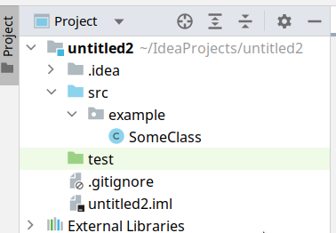
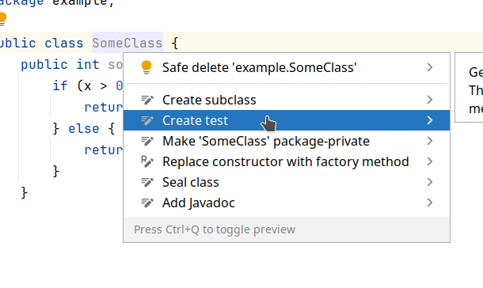
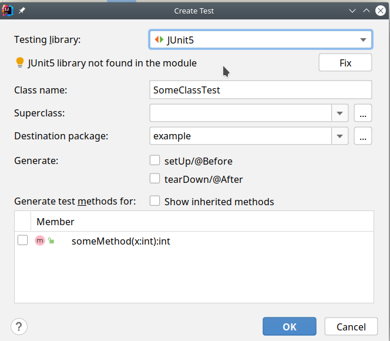
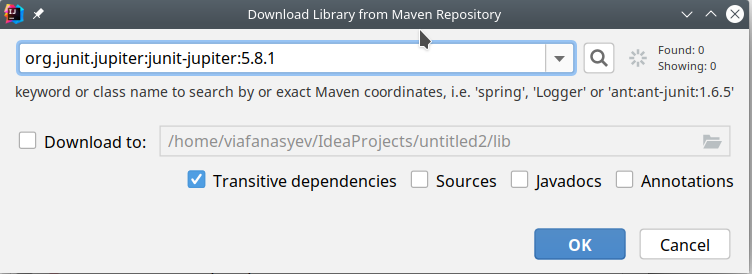
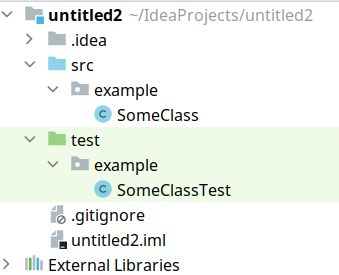
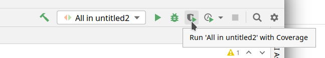

## План семинара №11

1. Настройка JUnit.
   1. В папке проекта создайте директорию `test`. Нажмите на неё ПКМ -> `Mark directory as` -> `Test sources root`. \
      В итоге должна получиться следующая картина: \
      
   2. Зайдите в исходные коды любого класса, нажмите ПКМ по его названию -> `Show Context Actions` -> `Create test`: \
      
   3. В открывшемся окне выберите **JUnit5**. Если JUnit ещё не был настроен, то вы увидите надпись "JUnit5 library not found in the module". Нажмите кнопку `Fix`. \
      
   4. В открывшемся окне необходимо выбрать актуальную версию библиотеки (обычно она выбирается автоматически). На момент написания этой инструкции, актуальной версией является 5.8.1. \
      Обязательно нужно выбрать галочку `Transitive dependencies`. \
      По желанию, можно выбрать галочку `Javadocs`, чтобы из IDEA была доступна документация на библиотеку. \
      Нажмите `OK`. \
      
   5. После того как библиотека установится, в директории `test` появится новый пустой класс для написания тестов.
      
   6. Теперь в директории `test` можно создавать свои классы и писать в них тесты.
2. Измерение покрытия исходного кода тестами.
   1. Для этого запустите тесты один раз стандартным образом, а затем в верхней панели нажмите `Run ... with Coverage`. \
      
3. Решение задач.